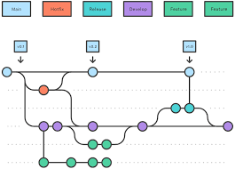
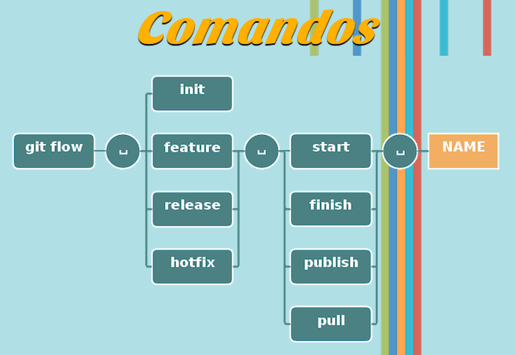

# Introdução

Para aprender em mais detalhes e fazer eventuais consultas acesse [aqui](https://git-scm.com/book/pt-br/v2/Come%c3%a7ando-Sobre-Controle-de-Vers%c3%a3o).

Git é um sistema de controle de versão popular, criado por Linus Torvalds em 2005 e tem sido mantido por Junio ​​Hamano desde então. Usado para:

- Alterações no código de rastreamento
- Rastreando quem fez alterações
- Colaboração de codificação

### Principais conceitos

- Repositório: uma pasta onde o Git rastreia seu projeto e seu histórico.
- Clonar: Faça uma cópia de um repositório remoto no seu computador.
- Etapa: informe ao Git quais alterações você deseja salvar em seguida.
- Confirmar: salve um instantâneo das suas alterações preparadas.
- Ramificação: Trabalhar em diferentes versões ou recursos ao mesmo tempo.
- Mesclar: combinar alterações de diferentes ramificações.
- Puxar: obter as últimas alterações de um repositório remoto.
- Push: envie suas alterações para um repositório remoto.

### Funcionamento

Ao inicializar o Git em uma pasta, ela se torna um repositório Git. Nesse momento, é criada uma pasta oculta chamada <code>.git</code>, responsável por monitorar e controlar todas as alterações feitas nos arquivos daquele diretório.

Sempre que um arquivo é adicionado, modificado ou removido, o Git detecta essa mudança e considera o arquivo como modificado. Para incluir essas alterações no histórico do projeto, você deve primeiro preparar os arquivos — isso é feito com o comando <code>git add</code>, que os coloca na chamada área de stage (ou área de preparação).

Depois, ao executar o <code>git commit</code>, o Git registra um instantâneo dos arquivos que estavam preparados, criando um ponto no tempo conhecido como commit. Cada commit representa um conjunto de mudanças e pode ser identificado de forma única.

Uma das grandes vantagens do Git é que ele não armazena cópias completas de todos os arquivos a cada commit. Em vez disso, ele registra apenas as diferenças (deltas) entre versões, o que torna o sistema altamente eficiente em termos de armazenamento.

Além disso, o Git permite consultar todo o histórico de commits, ver o que foi alterado, por quem e quando — e, se necessário, é possível reverter para qualquer estado anterior do projeto com segurança.

### GitHub

O GitHub cria ferramentas que usam o Git, sendo o maior host de código-fonte do mundo e pertence à Microsoft desde 2018.

# Instalação

É tão fácil que nem vou escrever sobre...

### Verificação da instalação

Após a instalação, verifique se o Git funciona abrindo seu terminal

```sh
git --version
git version 2.41.0.windows.3
```

Durante a instalação, o Git pede para você escolher um editor de texto padrão. Você pode alterar isso quando quiser.

```sh
git config --global core.editor "code --wait"
git config --global core.editor "notepad"
```

### Configurar o Git

Seu nome e e-mail será anexado aos seus commits. Defina-os com:

```sh
git config --global user.name "Your Name"
git config --global user.email "you@example.com"
```

Verifique suas configurações: 

```sh
git config --list
```

Dá para verificar um valor específico também, mas honestamente... usa esse comando ai e verifica tudo logo. Para alterar um valor, basta o mesmo comando com o novo valor. Para remover uma configuração, use:

```sh
git config --global --unset code.editor

```

Configurar o nome da branch principal padrão para novos repositórios (por exemplo, "main" em vez de "master"):

```sh
git config --global init.defaultBranch main
```

Existem três níveis de configuração:

- Sistema (todos os usuários): <code>git config --system</code>
- Global (usuário atual): <code>git config --global</code>
- Local (repositório atual): <code>git config --local</code>

A ordem de precedência é:

- Local (repositório atual)
- Global (usuário atual)
- Sistema (todos os usuários)

O motivo para usar níveis diferentes é que você pode definir valores diferentes para usuários ou repositórios diferentes. Isso pode ser usado, por exemplo, para definir diferentes ramificações padrões para diferentes repositórios e usuários.

Agora você adicionou o mínimo de configuração necessária e entendeu o mínimo para começar a usar o Git.

# Começando

Vou utilizar como exemplo esse repositório mesmo. As 3 etapas básicas são:

- Criar uma pasta de projeto
- Navegar até a pasta
- Inicializar um repositório Git

```sh
mkdir second_brain
cd second_brain
git init 
```

Quando você executa esse comando, ele cria uma pasta oculta chamada <code>.git</code> dentro do seu projeto.É aqui que o Git armazena todas as informações necessárias para rastrear seus arquivos e histórico.

# GitFlow

Baseado no [site oficial](https://danielkummer.github.io/git-flow-cheatsheet/index.pt_BR.html).



O git-flow é um conjunto de extensões para o git que provê operações de alto-nível para repositórios usando o modelo de branches do Vincent Driessen. Este cheatsheet demonstra o uso básico e o efeito das operações do git-flow. Você precisa do git instalado como pré-requisito.
O git flow funciona no macOS, Linux e no Windows.

Para o Windows:
```sh
$ wget -q -O - --no-check-certificate https://raw.github.com/petervanderdoes/gitflow-avh/develop/contrib/gitflow-installer.sh install stable | bash
```

### Inicialização

Comece o uso do git-flow fazendo sua inicialização dentro de um repositório git existente:

```sh
git flow init
```

Você precisa responder algumas questões relativas às convenções de nomenclatura dos seus branches. É recomendado que sejam usados os valores padrões.

## Funcionalidades/features

- Desenvolva novas funcionalidades para as versões futuras
- Normalmente existem apenas nos repositórios dos desenvolvedores

### Criar uma nova funcionalidade

O desenvolvimento de novas funcionalidades começa no branch 'develop'.

```sh
git flow feature start MYFEATURE
```

Esse comando cria uma nova branch da funcionalidade baseado no 'develop' e alterna para ele

### Finalizar uma funcionalidade

Finaliza o desenvolvimento de uma funcionalidade. Esse comando faz 3 coisas:

- Mescla MYFEATURE no 'develop'
- Remove a branch da funcionalidade
- Volta para a branch 'develop'

```sh
git flow feature finish MYFEATURE
```

### Publicar uma funcionalidade

Publique a nova funcionalidade para o servidor remoto, assim ela pode ser utilizada por outros usuários.

```sh
git flow feature publish MYFEATURE
```

### Obter uma funcionalidade publicada

Obtenha uma funcionalidade publicada por outro usuário e acompanhe as alterações remotas.

```sh
git flow feature pull MYFEATURE
```

## Criar uma versão/release

- Auxilia a preparação de uma nova versão de produção
- Permite correções de bugs menores e a preparação de metadados de uma versão

### Começar uma versão

Para começar uma versão, use o comando git flow release. Ele cria um branch da versão baseado no branch 'develop'.

```sh
git flow release start RELEASE [BASE]
```

Você pode opcionalmente fornecer um hash sha-1 do commit <code>[BASE]</code> de onde começar a versão. O commit precisa estar no branch 'develop'. É sensato publicar a branch da versão depois de criá-la, para permitir commits por outros desenvolvedores. É semelhante à publicação de uma funcionalidade com o comando:

```sh
git flow release publish RELEASE
```

(Você pode acompanhar uma versão remota com o comando <code>git flow release track RELEASE</code>)

### Finalizar uma versão

A finalização de uma versão é um dos grandes passos na ramificação/branching do git. Ele executa várias ações:

- Mescla o branch da versão no 'master'
- Etiqueta a versão com seu nome
- Mescla o branch da versão de volta no 'develop'
- Remove o branch da versão

```sh
git flow release finish RELEASE
```

## Hotfixes

- Os hotfixes surgem da necessidade de agir imediatamente sobre uma situação indesejada na versão de produção ativa
- Pode ser criado a partir da tag correspondente no branch master que indica a versão em produção.

### git flow hotfix start

Assim como os outros comandos do git flow, um hotfix inicia com

```sh
git flow hotfix start VERSION [BASENAME]
```

O argumento version marca o nome do novo hotfix. Opcionalmente, você pode especificar um basename para começar.

### Finalizar um hotfix

Ao finalizar um hotfix ele é mesclado tanto no develop quanto no master. Além disso, o merge no master é etiquetado.

```sh
git flow hotfix finish VERSION
```

